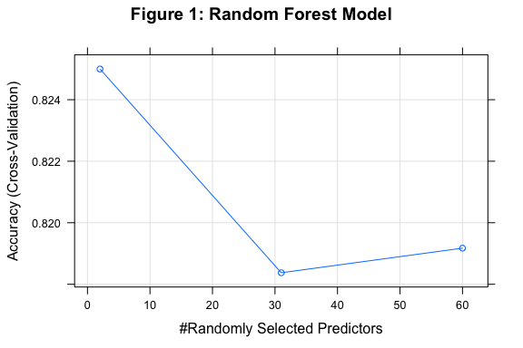
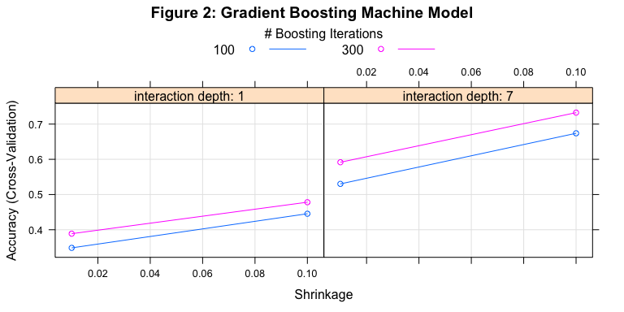
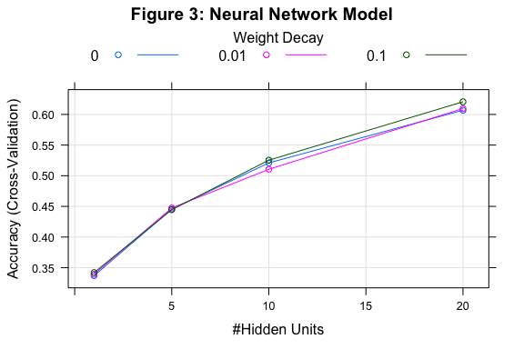
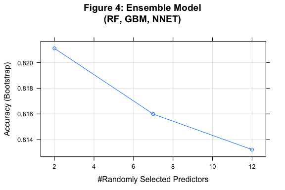

## Prediction Assignment Writeup: Barbell Lifts

### Executive Summary
Weight Lifting Exercises dataset is to investigate "how (well)" an activity was performed by the wearer. Six young health participants were asked to perform one set of 10 repetitions of the Unilateral Dumbbell Biceps Curl in five different fashions: exactly according to the specification (Class A), throwing the elbows to the front (Class B), lifting the dumbbell only halfway (Class C), lowering the dumbbell only halfway (Class D) and throwing the hips to the front (Class E).

The goal of this project is to use data from accelerometers on the belt, forearm, arm, and dumbell of the 6 participants to predict the proper class of the barbell lift i.e. "classe" A, B, C, D, or E.

Three classification models were individually created and evaluated then combined into an ensemble model to improve prediction. Training and testing of all models was performed using just the build data i.e. "pml-training.csv" which was 70/30 split into training and testing data sets. The final ensemble model was evaluated once against the validation data i.e. "pml-testing.csv" and resulted in a 90% prediction accuracy during automated grading.

### Data Processing
#### Load Libraries

```r
#load libraries and set options
library(caret)
library(dplyr)
options(dplyr.width = Inf, dplyr.print_max = 1000)
```

#### Load Data
Load the Weight Lifting Exercises files. Assign the 'pml-training.csv' data set to model building. Assign the 'pml-testing.csv' data set to final validation.

```r
#load model building data
build0_data <- read.csv(file = 'pml-training.csv')

#load validation data
valid0_data <- read.csv(file = 'pml-testing.csv')
```

#### Pre-process Data
Pre-process the model build and validation data sets by removing fields that have more than 50% as NA or empty field as well as fields that are timestamps.

```r
#model building subset
#valid values per column threshold percent
invalid_thresh <- 0.50

#remove fields with NA values over threshold value from data sets
build1_data <- build0_data[, colSums(is.na(build0_data)) 
                                 <= nrow(build0_data) * invalid_thresh]

#remove fields with empty values over threshold value from data sets
build1_data <- build1_data[, colSums(build1_data == '') 
                                 <= nrow(build1_data) * invalid_thresh]

#remove timestamp fields
build1_data <- build1_data %>%
                   select(-contains('timestamp')
)

#----------
#validation subset
#match validation data set columns used to build subset
col_pattern <- paste('^',
                     colnames(build1_data),
                     '$',
                     sep = '',
                     collapse = '|'
)

#include problem_id field in validation data
col_pattern <- paste(col_pattern,
                     '^problem_id$',
                     sep = '|'
)

valid1_data <- valid0_data[, grep(col_pattern, colnames(valid0_data))]
```

#### Create Model Building Training and Test Data Sets
Randomly split the model build data set with 70% used in the model training data set and 30% used in the testing data set. Define the 'classe' variable as the factor to evenly distribute among the splits.

```r
#training subset
train1_flag <- createDataPartition(y = build1_data$classe,
                                   p = 0.7,
                                   list = FALSE
)

train1_data <- build1_data[train1_flag, ]

#----------
#testing subset
test1_data <- build1_data[-train1_flag, ]
```

### Random Forest Model (RF)
#### Train and Test Model
Pre-process the training data using Principle Components Analysis (PCA) with a 50% variance explained threshold to scale, center, and limit variables used in model. Higher thresholds of 65%, 80%, and 95% levels were investigated but yielded significant model overfitting. Use 10-fold cross validation to train the model.

```r
#set training and pre-processing parameters
trainrf1_ctrl <- trainControl(method = 'cv',
                              preProcOptions = list(thresh = 0.50)
)

#create training model
set.seed(100)

trainrf1_model <- train(classe ~ ., 
                        data = train1_data, 
                        method = 'rf',
                        preProcess = c('pca'),
                        trControl = trainrf1_ctrl
)

#create predictions on test data
testrf1_pred <- predict(trainrf1_model,
                        newdata = test1_data
)
```

#### Model Results
Final fitted model details built on training data set.

```r
#training
#model details
trainrf1_model$finalModel
```

```

Call:
 randomForest(x = x, y = y, mtry = param$mtry) 
               Type of random forest: classification
                     Number of trees: 500
No. of variables tried at each split: 2

        OOB estimate of  error rate: 16.55%
Confusion matrix:
     A    B    C    D    E class.error
A 3491  101  143  121   50   0.1062468
B  213 2058  217   92   78   0.2257336
C  127  182 1892  136   59   0.2103506
D   83   81  147 1875   66   0.1674067
E   65   98  108  106 2148   0.1493069
```

```r
#model plot
plot(main = 'Figure 1: Random Forest Model', trainrf1_model)
```

<!-- -->

Prediction results using fitted model on testing data set.

```r
#testing
#model results
testrf1_result <- confusionMatrix(data = testrf1_pred,
                                  reference = test1_data$classe
)

testrf1_result
```

```
Confusion Matrix and Statistics

          Reference
Prediction    A    B    C    D    E
         A 1482  108   61   37   32
         B   43  846   74   54   44
         C   67   91  806   60   41
         D   62   56   57  790   42
         E   20   38   28   23  923

Overall Statistics
                                          
               Accuracy : 0.8236          
                 95% CI : (0.8136, 0.8333)
    No Information Rate : 0.2845          
    P-Value [Acc > NIR] : < 2.2e-16       
                                          
                  Kappa : 0.7768          
 Mcnemar's Test P-Value : 7.188e-07       

Statistics by Class:

                     Class: A Class: B Class: C Class: D Class: E
Sensitivity            0.8853   0.7428   0.7856   0.8195   0.8530
Specificity            0.9435   0.9547   0.9467   0.9559   0.9773
Pos Pred Value         0.8616   0.7974   0.7568   0.7845   0.8944
Neg Pred Value         0.9539   0.9393   0.9544   0.9643   0.9672
Prevalence             0.2845   0.1935   0.1743   0.1638   0.1839
Detection Rate         0.2518   0.1438   0.1370   0.1342   0.1568
Detection Prevalence   0.2923   0.1803   0.1810   0.1711   0.1754
Balanced Accuracy      0.9144   0.8487   0.8661   0.8877   0.9152
```

Final model was chosen based on overall accuracy having ``2`` variables at each split using ``500`` trees.

Overall accuracy of model prediction on test data set is ``0.824`` or an expected error rate of ``0.176``


### Gradient Boosting Machine (GBM)
#### Train and Test Model
Pre-process the training data using Principle Components Analysis (PCA) with a 50% variance explained threshold to scale, center, and limit variables used in model. Higher thresholds of 65%, 80%, and 95% levels were investigated but yielded significant model overfitting. Use 10-fold cross validation to train the model. Use a tuning grid to optimize for best training parameters i.e. number of trees 100 or 300, shrinkage 0.1 or 0.01, and interaction depth 1 or calculated maximum based on variable count. Set minimum observations in node to 10.

```r
#training
#max interaction.depth
mtry_def <- floor(sqrt(ncol(train1_data)))

#set tuning grid for model parameters
traingbm1_grid <- expand.grid(interaction.depth = c(1, mtry_def),
                              n.trees = c(100, 300),
                              shrinkage = c(0.1, 0.01),
                              n.minobsinnode = c(10)
)

#set training and pre-processing parameters
traingbm1_ctrl <- trainControl(method = 'cv',
                               allowParallel = FALSE,
                               preProcOptions = list(thresh = 0.50)
)

#create training model
set.seed(100)

traingbm1_model <- train(classe ~ ., 
                         data = as.data.frame(train1_data), 
                         method = 'gbm',
                         tuneGrid = traingbm1_grid,
                         preProcess = c('pca'),
                         trControl = traingbm1_ctrl,
                         verbose = FALSE
)

#create predictions on test data
testgbm1_pred <- predict(traingbm1_model,
                         newdata = test1_data
)
```

#### Model Results
Final fitted model details built on training data set.

```r
#training
#model details
traingbm1_model$finalModel
```

```
A gradient boosted model with multinomial loss function.
300 iterations were performed.
There were 5 predictors of which 5 had non-zero influence.
```

```r
#model plot
plot(main = 'Figure 2: Gradient Boosting Machine Model', traingbm1_model)
```

<!-- -->

Prediction results using fitted model on testing data set.

```r
#testing
#model results
testgbm1_result <- confusionMatrix(data = testgbm1_pred,
                                   reference = test1_data$classe
)

testgbm1_result
```

```
Confusion Matrix and Statistics

          Reference
Prediction    A    B    C    D    E
         A 1378  147   87   55   39
         B   72  713  106   74   65
         C  118  127  702   93   79
         D   74   77   77  694   63
         E   32   75   54   48  836

Overall Statistics
                                          
               Accuracy : 0.7346          
                 95% CI : (0.7231, 0.7458)
    No Information Rate : 0.2845          
    P-Value [Acc > NIR] : < 2.2e-16       
                                          
                  Kappa : 0.6642          
 Mcnemar's Test P-Value : 2.403e-06       

Statistics by Class:

                     Class: A Class: B Class: C Class: D Class: E
Sensitivity            0.8232   0.6260   0.6842   0.7199   0.7726
Specificity            0.9221   0.9332   0.9142   0.9409   0.9565
Pos Pred Value         0.8077   0.6922   0.6273   0.7046   0.8000
Neg Pred Value         0.9292   0.9123   0.9320   0.9449   0.9492
Prevalence             0.2845   0.1935   0.1743   0.1638   0.1839
Detection Rate         0.2342   0.1212   0.1193   0.1179   0.1421
Detection Prevalence   0.2899   0.1750   0.1901   0.1674   0.1776
Balanced Accuracy      0.8726   0.7796   0.7992   0.8304   0.8646
```

Final model was chosen based on overall accuracy having an interaction depth of ``7`` with ```` shrinkage using ```` trees.

Overall accuracy of model prediction on test data set is ``0.735`` or an expected error rate of ``0.265``


### Neural Network (NNET)
#### Train and Test Model
Pre-process the training data using Principle Components Analysis (PCA) with a 50% variance explained threshold to scale, center, and limit variables used in model. Higher thresholds of 65%, 80%, and 95% levels were investigated but yielded significant model overfitting. Use 10-fold cross validation to train the model. Use a tuning grid to optimize for best training parameters i.e. decay of 0, 0.01, or 0.1 and size of 1, 5, 10, or 20 hidden units. Size of 20 hidden units is close to max allowable given current variable set. Set max iterations to 500.

```r
#training
#max node weights
max_nwt <- 5 * (ncol(train1_data) + 1) + 5 + 1

#set tuning grid for model parameters
trainnet1_grid <- expand.grid(decay = c(0, 0.01, 0.1),
                              size = c(1, 5, 10, 20)
)

#set training and pre-processing parameters
trainnet1_ctrl <- trainControl(method = 'cv',
                               allowParallel = FALSE,
                               preProcOptions = list(thresh = 0.50)
)

#create training model
set.seed(100)

trainnet1_model <- train(classe ~ ., 
                         data = as.data.frame(train1_data), 
                         method = 'nnet',
                         tuneGrid = trainnet1_grid,
                         preProcess = c('pca'),
                         trControl = trainnet1_ctrl,
                         MaxNWts = max_nwt,
                         maxit = 500,
                         bag = FALSE,
                         linout =TRUE,
                         trace = FALSE
)

#create predictions on test data
testnet1_pred <- predict(trainnet1_model,
                         newdata = test1_data
)
```

#### Model Results
Final fitted model details built on training data set.

```r
#training
#model details
trainnet1_model$finalModel
```

```
a 5-20-5 network with 225 weights
inputs: PC1 PC2 PC3 PC4 PC5 
output(s): .outcome 
options were - softmax modelling  decay=0.1
```

```r
#model plot
plot(main = 'Figure 3: Neural Network Model', trainnet1_model)
```

<!-- -->

Prediction results using fitted model on testing data set.

```r
#testing
#model results
testnet1_result <- confusionMatrix(data = testnet1_pred,
                                   reference = test1_data$classe
)

testnet1_result
```

```
Confusion Matrix and Statistics

          Reference
Prediction    A    B    C    D    E
         A 1250  181  165   53   50
         B  110  527  164   79  119
         C  146  163  478  174   94
         D  106  145  165  593  132
         E   62  123   54   65  687

Overall Statistics
                                         
               Accuracy : 0.6007         
                 95% CI : (0.588, 0.6132)
    No Information Rate : 0.2845         
    P-Value [Acc > NIR] : < 2.2e-16      
                                         
                  Kappa : 0.4952         
 Mcnemar's Test P-Value : 3.736e-15      

Statistics by Class:

                     Class: A Class: B Class: C Class: D Class: E
Sensitivity            0.7467  0.46269  0.46589   0.6151   0.6349
Specificity            0.8934  0.90055  0.88125   0.8886   0.9367
Pos Pred Value         0.7357  0.52753  0.45308   0.5197   0.6932
Neg Pred Value         0.8987  0.87474  0.88654   0.9218   0.9193
Prevalence             0.2845  0.19354  0.17434   0.1638   0.1839
Detection Rate         0.2124  0.08955  0.08122   0.1008   0.1167
Detection Prevalence   0.2887  0.16975  0.17927   0.1939   0.1684
Balanced Accuracy      0.8200  0.68162  0.67357   0.7519   0.7858
```

Final model was chosen based on overall accuracy having ``0.1`` decay with size ``20`` hidden units.

Overall accuracy of model prediction on test data set is ``0.601`` or an expected error rate of ``0.399``


### Ensemble (combine RF, GBM, and NNET models)
#### Train and Validate Model
Combine the previously created random forest, gradient boosting machine, and neural network models into an ensemble model. Neural network model was included even though it had a much lower accuracy than the other two models since it uses a completely different algorithm than RF or GBM. Train the ensemble model using a random forest method with bootstrap.

```r
#training
#create data set of predicted values from test data using the RF, GBM, and NNET models
trainens1_data <- data.frame(rf_pred = testrf1_pred,
                             gbm_pred = testgbm1_pred,
                             net_pred = testnet1_pred,
                             classe = test1_data$classe
)

#create training model
set.seed(100)

trainens1_model <- train(classe ~ .,
                         method = 'rf',
                         data = trainens1_data,
                         trControl = trainControl(method = 'boot')
)

#----------
#validation
#random forest predictions on validation data
validrf1_pred <- predict(trainrf1_model,
                         newdata = valid1_data
)

#gradient boosting machine predictions on validation data
validgbm1_pred <- predict(traingbm1_model,
                          newdata = valid1_data
)

#neural network predictons on validation data
validnet1_pred <- predict(trainnet1_model,
                          newdata = valid1_data
)

#-----
#create data set of predicted values from validation data using the RF, GBM, and NNET models
validens1_data <- data.frame(rf_pred = validrf1_pred,
                             gbm_pred = validgbm1_pred,
                             net_pred = validnet1_pred
)

#create predictions on validation data
validens1_pred <- predict(trainens1_model,
                          newdata = validens1_data
)

#cbind(validens1_data, validens1_pred)
```

#### Model Results
Final fitted model details built on training data set.

```r
#training
#model details
trainens1_model$finalModel
```

```

Call:
 randomForest(x = x, y = y, mtry = param$mtry) 
               Type of random forest: classification
                     Number of trees: 500
No. of variables tried at each split: 2

        OOB estimate of  error rate: 17.69%
Confusion matrix:
     A   B   C   D   E class.error
A 1479  43  68  63  21   0.1164875
B  107 846  91  56  39   0.2572432
C   61  74 806  57  28   0.2144250
D   37  54  60 790  23   0.1804979
E   32  44  41  42 923   0.1469501
```

```r
#model plot
plot(main = 'Figure 4: Ensemble Model\n(RF, GBM, NNET)', trainens1_model)
```

<!-- -->

Final model was chosen based on overall accuracy having ``2`` variables at each split


### Final Results
The final ensemble model was evaluated once against the validation data i.e. "pml-testing.csv" and resulted in a 90% prediction accuracy during automated grading.

Prediction results on validation data:
``1-B, 2-A, 3-A, 4-A, 5-A, 6-E, 7-D, 8-E, 9-A, 10-A, 11-B, 12-C, 13-B, 14-A, 15-E, 16-E, 17-A, 18-B, 19-B, 20-B``
